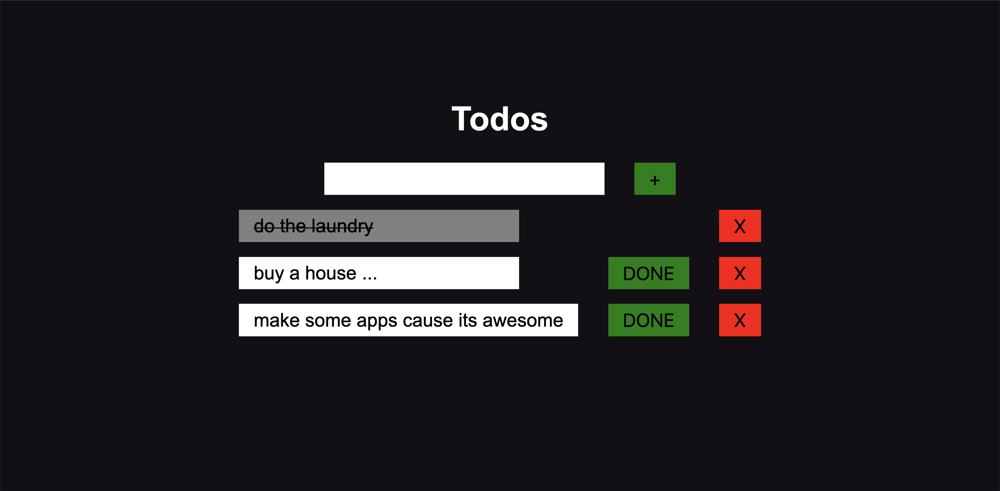

## Todolist

## Available Scripts on client side

In the client directory, you can run:

### `npm start`

Runs the app in the development mode. 
Open [http://localhost:3000](http://localhost:3000) to view it in the browser.

## Aviable scripts on server side

In the server directory, you can run:

### `npm start`

Runs the server in the development mode. 
Open [http://localhost:5000](http://localhost:5000) to view it in the browser.

## For this app u will need mongoDB database

Something like Atlas [https://www.mongodb.com/].
Info for connection DB is in env.example file.
